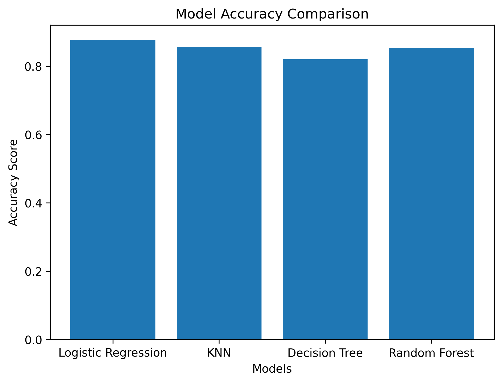

# 🎓 Student Pass/Fail Prediction

## 📌 Project Overview

This project predicts whether a student will **Pass** or **Fail** using Machine Learning classification algorithms. Multiple models were trained and evaluated to identify the best-performing model based on various evaluation metrics.

---

## 📂 Dataset

- **Dataset:** Student Performance Factors
- **Source:** Kaggle (by **lainguyn123**)

---

## 📊 Features Used

- Hours Studied
- Attendance
- Previous Scores

---

## 🛠️ Data Preprocessing

- Removed duplicate values
- Checked for missing values
- Performed label encoding
- Selected relevant features
- Split the dataset into training and testing sets

---

## 📈 Exploratory Data Analysis (EDA)

- Histogram
- Box Plot
- Correlation Heatmap

---

## 🤖 Machine Learning Models

- Logistic Regression
- K-Nearest Neighbors (KNN)
- Decision Tree
- Random Forest

---

## 📊 Model Performance

| Model | Accuracy | Precision | Recall | F1-Score |
|--------|---------:|----------:|-------:|---------:|
| Logistic Regression | **87.67%** | **90.33%** | **94.28%** | **92.26%** |
| KNN | 85.55% | 89.11% | 92.82% | 90.93% |
| Decision Tree | 82.07% | 88.10% | 89.04% | 88.57% |
| Random Forest | 85.40% | 88.80% | 93.02% | 90.86% |

---

## 📉 Model Accuracy Comparison

---

## ✅ Conclusion

Four machine learning classification algorithms were trained and evaluated to predict student performance.

Among them, **Logistic Regression** achieved the highest Accuracy, Precision, Recall, and F1-Score, making it the best-performing model for this dataset.

---

## 💻 Technologies Used

- Python
- Pandas
- NumPy
- Matplotlib
- Seaborn
- Scikit-learn
